# 🌸 JOBSHEET 5 - PEMOGRAMAN MOBILE 🌸

---

### 👩🏻‍💻 Identitas Mahasiswa
| **Nama** | **Kelas** | **No. Absen** |
|-----------|------------|---------------|
| 💕 My Babby Findia R.S 💕 | 🌼 SIB – 3D 🌼 | 🌷 15 🌷 |

---

## 🧩 TUGAS PRAKTIKUM 1

### 🌟 Langkah 1: Buat Project Baru
Buatlah sebuah project flutter baru dengan nama **layout_flutter**.  
Atau sesuaikan style laporan praktikum yang Anda buat.  
📸 **Screenshot:**  
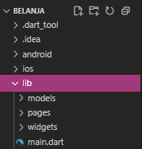

---

### 🌸 Langkah 2: Buka file lib/main.dart
Buka file **main.dart** lalu ganti dengan kode berikut.  
Isi nama dan NIM Anda di text title.  
📸 **Screenshot:**  
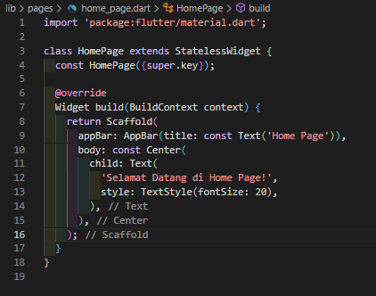

---

### 🌼 Langkah 3: Identifikasi layout diagram
Langkah pertama adalah memecah tata letak menjadi elemen dasarnya:

- Identifikasi baris dan kolom.  
- Apakah tata letaknya menyertakan kisi-kisi (grid)?  
- Apakah ada elemen yang tumpang tindih?  
- Apakah UI memerlukan tab?  
- Perhatikan area yang memerlukan alignment, padding, atau borders.  

Pertama, identifikasi elemen yang lebih besar. Dalam contoh ini, empat elemen disusun menjadi sebuah kolom: sebuah gambar, dua baris, dan satu blok teks.  
📸 **Screenshot:**  
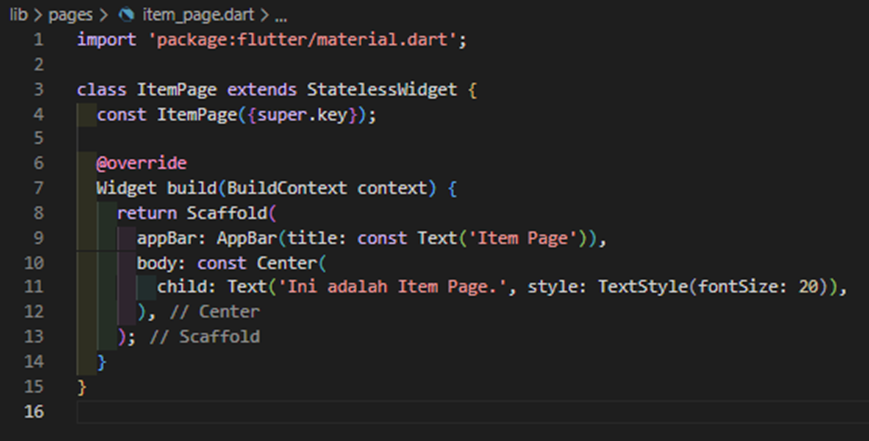

Selanjutnya, buat diagram setiap baris. Baris pertama, disebut bagian **Judul**, memiliki 3 anak: kolom teks, ikon bintang, dan angka.  
Anak pertamanya, kolom, berisi 2 baris teks. Kolom pertama itu memakan banyak ruang, sehingga harus dibungkus dengan widget **Expanded**.  
📸 **Screenshot:**  
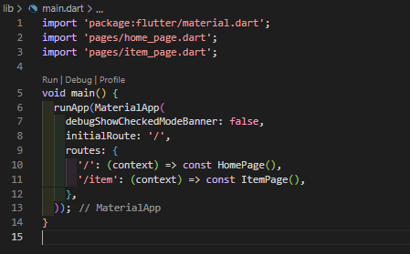

Baris kedua, disebut bagian **Tombol**, juga memiliki 3 anak: setiap anak merupakan kolom yang berisi ikon dan teks.  
📸 **Screenshot:**  
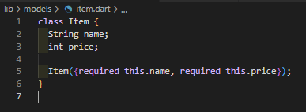

Setelah tata letak telah dibuat diagramnya, cara termudah adalah dengan menerapkan pendekatan **bottom-up**.  
Untuk meminimalkan kebingungan visual dari kode tata letak yang banyak bertumpuk, tempatkan beberapa implementasi dalam variabel dan fungsi. 🌻

---

### 🌷 Langkah 4: Implementasi title row
Pertama, Anda akan membuat kolom bagian kiri pada judul.  
Tambahkan kode berikut di bagian atas metode **build()** di dalam kelas **MyApp**:  
📸 **Screenshot:**  
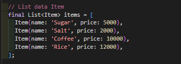

---

🩵 **Soal 1:**  
Letakkan widget **Column** di dalam widget **Expanded** agar menyesuaikan ruang yang tersisa di dalam widget Row.  
Tambahkan properti `crossAxisAlignment` ke `CrossAxisAlignment.start` sehingga posisi kolom berada di awal baris.  

🩷 **Soal 2:**  
Letakkan baris pertama teks di dalam **Container** sehingga memungkinkan Anda untuk menambahkan padding = 8.  
Teks *‘Batu, Malang, Indonesia’* di dalam Column, set warna menjadi abu-abu.  

💜 **Soal 3:**  
Dua item terakhir di baris judul adalah ikon bintang (warna merah) dan teks `"41"`.  
Seluruh baris ada di dalam **Container** dan beri padding di sepanjang setiap tepinya sebesar 32 piksel.  
Kemudian ganti isi body text *‘Hello World’* dengan variabel `titleSection` seperti berikut:  
📸 **Screenshot:**  
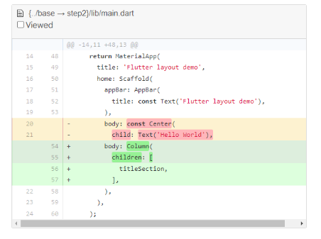

---

## 💫 Praktikum 2: Implementasi button row

### 🌸 Langkah 1: Buat method Column _buildButtonColumn
Bagian tombol berisi 3 kolom yang menggunakan tata letak yang sama — sebuah ikon di atas baris teks.  
Kolom pada baris ini diberi jarak yang sama, dan teks serta ikon diberi warna primer.  

Karena kode untuk membangun setiap kolom hampir sama, buatlah metode pembantu pribadi bernama `_buildButtonColumn()`,  
yang mempunyai parameter warna, Icon dan Text, sehingga dapat mengembalikan kolom dengan widgetnya sesuai warna tertentu.  

📂 **File:** `lib/main.dart`  
📸 **Screenshot:**  
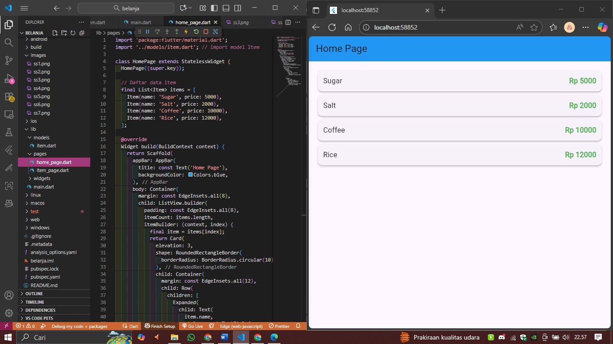

---

### 🌷 Langkah 2: Buat widget buttonSection
Buat Fungsi untuk menambahkan ikon langsung ke kolom.  
Teks berada di dalam Container dengan margin hanya di bagian atas, yang memisahkan teks dari ikon.  

Bangun baris yang berisi kolom-kolom ini dengan memanggil fungsi dan set warna, Icon, dan teks khusus melalui parameter ke kolom tersebut.  
Gunakan `MainAxisAlignment.spaceEvenly` untuk mengatur ruang kosong secara merata.  

Tambahkan kode berikut tepat di bawah deklarasi `titleSection` di dalam metode **build()**:  
📸 **Screenshot:**  
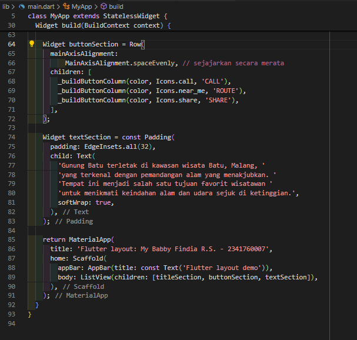

---

## 🌿 Praktikum 3: Implementasi text section

### 🌸 Langkah 1: Buat widget textSection
Tentukan bagian teks sebagai variabel.  
Masukkan teks ke dalam Container dan tambahkan padding di sepanjang setiap tepinya.  
Tambahkan kode berikut tepat di bawah deklarasi `buttonSection`:  
📸 **Screenshot:**  
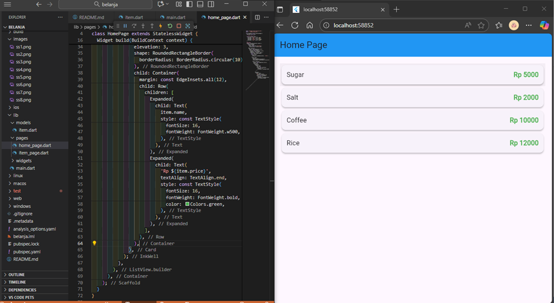

Dengan memberi nilai `softWrap = true`, baris teks akan memenuhi lebar kolom sebelum membungkusnya pada batas kata. 🌷

---

### 🌼 Langkah 2: Tambahkan variabel text section ke body
Tambahkan widget variabel `textSection` ke dalam body seperti berikut:  
📸 **Screenshot:**  
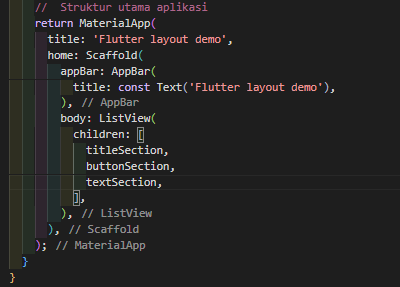

---

## 🌻 Praktikum 4: Implementasi image section

### 🌸 Langkah 1: Siapkan aset gambar
Anda dapat mencari gambar di internet yang ingin ditampilkan.  
Buatlah folder `images` di root project **layout_flutter**.  
Masukkan file gambar tersebut ke folder `images`, lalu set nama file tersebut ke file **pubspec.yaml** seperti berikut:  
📸 **Screenshot:**  
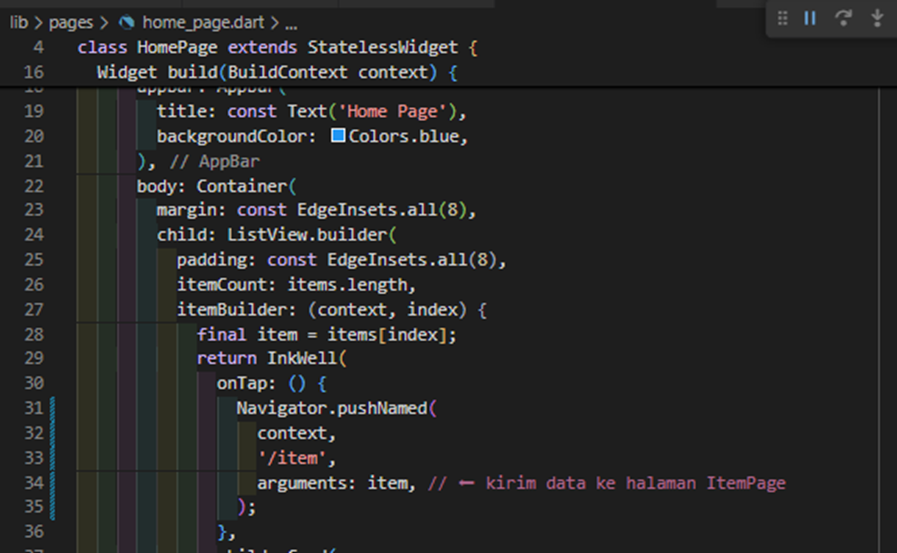

---

### 🌼 Langkah 2: Tambahkan gambar ke body
Tambahkan aset gambar ke dalam body seperti berikut:  
📸 **Screenshot:**  
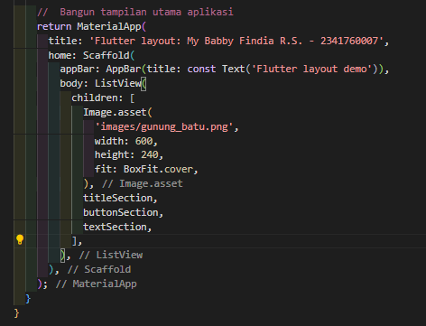

`BoxFit.cover` memberi tahu kerangka kerja bahwa gambar harus sekecil mungkin tetapi menutupi seluruh kotak rendernya. 🌷

---

### 🌸 Langkah 3: Terakhir, ubah menjadi ListView
Pada langkah terakhir ini, atur semua elemen dalam **ListView**, bukan **Column**, karena ListView mendukung scroll yang dinamis saat aplikasi dijalankan pada perangkat dengan resolusi kecil.  
📸 **Screenshot:**  
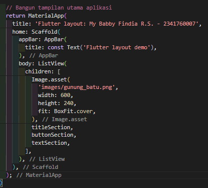

---

## 🌈 HASIL OUTPUT
✨ Tampilan akhir aplikasi kamu akan seperti ini:  
📸 **Screenshot:**  
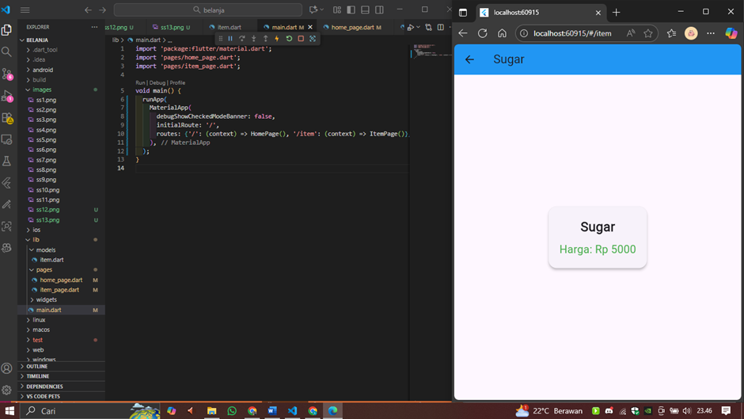

---

💖 **Selamat!** Kamu telah menyelesaikan **Jobsheet 5 - Layout Flutter** dengan penuh warna dan semangat! 🌸  
Semoga hasilnya seindah kode yang kamu tulis 🌷✨
