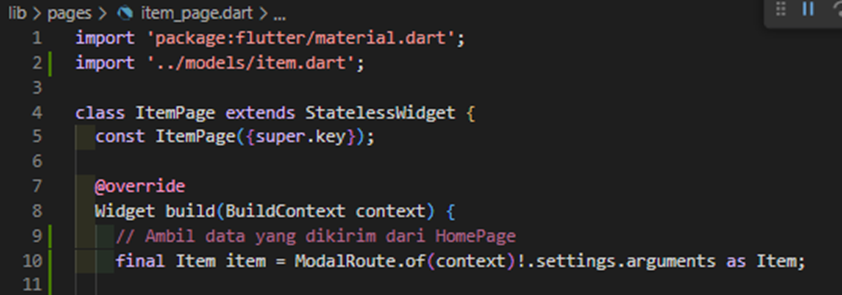
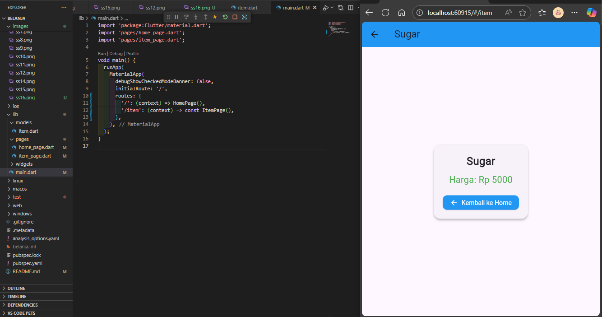
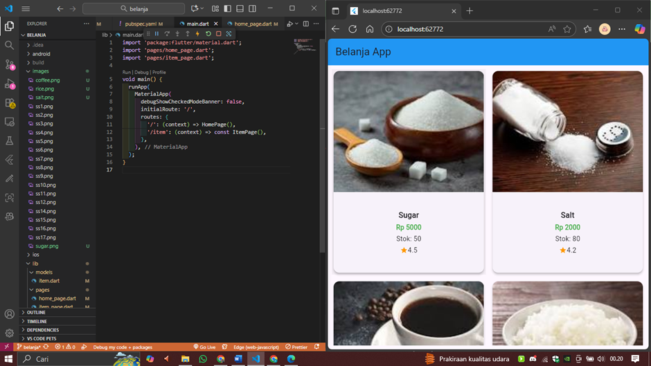
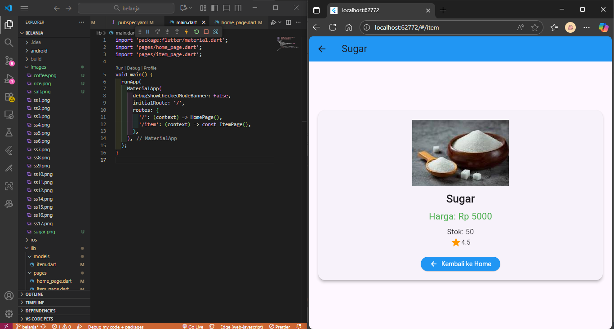
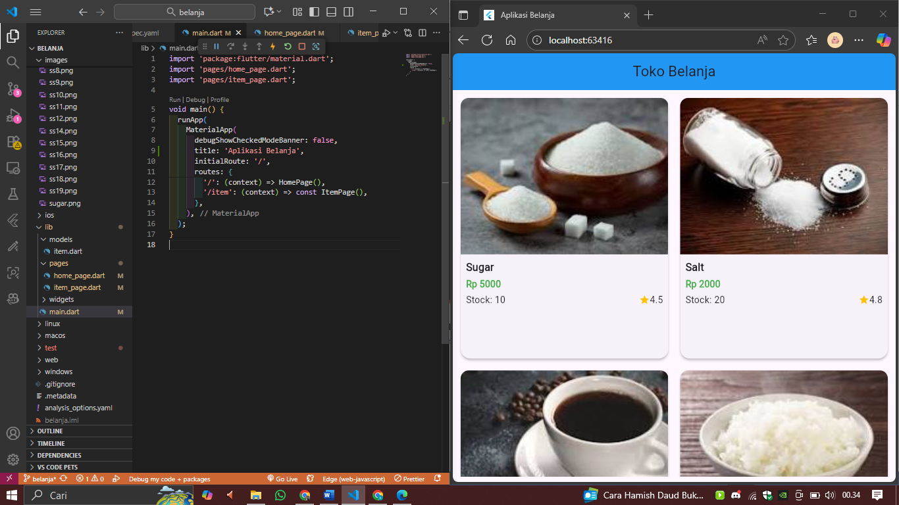
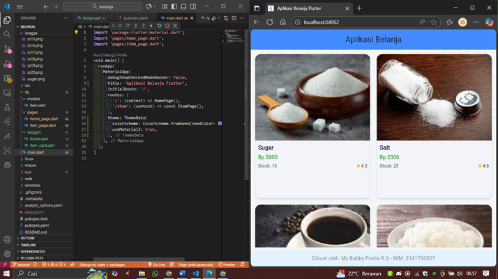
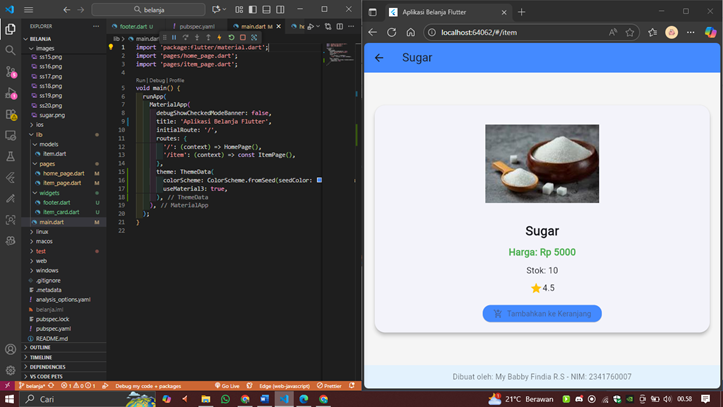
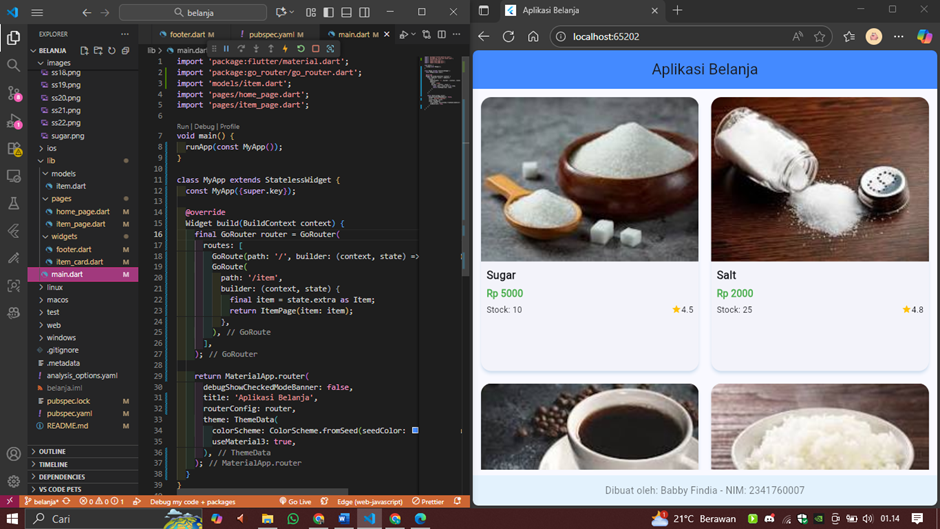
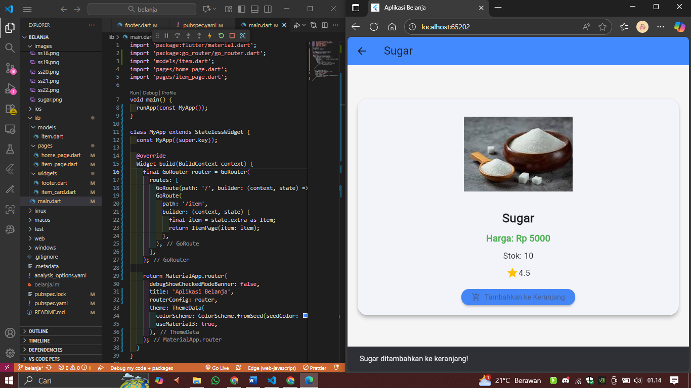

# 🛍️ Praktikum 5: Membangun Navigasi di Flutter 💙

---

## 🧱 Langkah 1: Siapkan project baru  

Sebelum melanjutkan praktikum, buatlah sebuah project baru Flutter dengan nama **belanja** dan susunan folder seperti pada gambar berikut.  
Penyusunan ini dimaksudkan untuk mengorganisasi kode dan widget yang lebih mudah 🗂️  

---

## 🚪 Langkah 2: Mendefinisikan Route  

Buatlah dua buah file dart dengan nama **home_page.dart** dan **item_page.dart** pada folder *pages*.  
Untuk masing-masing file, deklarasikan class **HomePage** pada file *home_page.dart* dan **ItemPage** pada *item_page.dart*.  
Turunkan class dari **StatelessWidget**.  

📄 *home_pages.dart*  

📄 *item_pages.dart*  

---

## 🗺️ Langkah 3: Lengkapi Kode di main.dart  

Setelah kedua halaman telah dibuat dan didefinisikan, bukalah file **main.dart**.  
Pada langkah ini anda akan mendefinisikan Route untuk kedua halaman tersebut.  

🧭 Definisi penamaan route harus bersifat **unique**.  
Halaman **HomePage** didefinisikan sebagai `/`.  
Dan halaman **ItemPage** didefinisikan sebagai `/item`.  

Untuk mendefinisikan halaman awal, anda dapat menggunakan named argument `initialRoute`.  

---

## 💾 Langkah 4: Membuat data model  

Sebelum melakukan perpindahan halaman dari **HomePage** ke **ItemPage**, dibutuhkan proses pemodelan data.  
Pada desain mockup, dibutuhkan dua informasi yaitu **nama** dan **harga**.  

Untuk menangani hal ini, buatlah sebuah file dengan nama **item.dart** dan letakkan pada folder *models*.  
Pada file ini didefinisikan pemodelan data yang dibutuhkan.  

---

## 🏠 Langkah 5: Lengkapi kode di class HomePage  

Pada halaman **HomePage** terdapat **ListView widget**.  
Sumber data ListView diambil dari model **List dari object Item**.  

📋 Gambaran kode yang dibutuhkan untuk melakukan definisi model dapat anda lihat sebagai berikut.  

---

## 🧩 Langkah 6: Membuat ListView dan itemBuilder  

Untuk menampilkan **ListView** pada praktikum ini digunakan **itemBuilder**.  
Data diambil dari definisi model yang telah dibuat sebelumnya.  

Untuk menunjukkan batas data satu dan berikutnya digunakan widget **Card**.  
(Kode yang telah umum pada bagian ini tidak ditampilkan 😄)  

  

---

## 🖱️ Langkah 7: Menambahkan aksi pada ListView  

Item pada ListView saat ini ketika ditekan masih belum memberikan aksi tertentu 🫠  

Untuk menambahkan aksi pada ListView dapat digunakan widget **InkWell** atau **GestureDetector**.  
Perbedaan utamanya:  
- ✨ **InkWell** memberikan efek ketika ditekan.  
- 🖐️ **GestureDetector** lebih umum dan bisa juga digunakan untuk gesture lain.  

Pada praktikum ini akan digunakan widget **InkWell**.  

👉 Letakkan cursor pada widget pembuka **Card**, kemudian gunakan shortcut quick fix dari VSCode:  
- Windows: `Ctrl + .`  
- MacOS: `Cmd + .`  

Pilih menu **Wrap with widget...**, ubah nilai widget menjadi **InkWell** dan tambahkan named argument `onTap` untuk berpindah ke halaman **ItemPage**.  

🚀 Jalankan aplikasi kembali dan pastikan **ListView** dapat disentuh dan berpindah ke halaman berikutnya.  
Periksa kembali jika terdapat kesalahan.  

  

---

# 🧩 Tugas Praktikum 2  

---

## 💌 1. Pengiriman Data ke Halaman Berikutnya  

Untuk melakukan pengiriman data ke halaman berikutnya, cukup menambahkan informasi `arguments` pada penggunaan **Navigator**.  
Perbarui kode pada bagian Navigator menjadi seperti berikut.  

📄 *home_page.dart*  

📄 *item_page.dart*  

📸 **HASIL OUTPUT:**  
  

---

## 🧠 2. Pembacaan Nilai yang Dikirimkan  

Pembacaan nilai yang dikirimkan pada halaman sebelumnya dapat dilakukan menggunakan **ModalRoute**.  
Tambahkan kode berikut pada blok fungsi **build** dalam halaman **ItemPage**.  

Setelah nilai didapatkan, anda dapat menggunakannya seperti penggunaan variabel pada umumnya 🧮  

🔗 (Sumber: [docs.flutter.dev/cookbook/navigation/navigate-with-arguments](https://docs.flutter.dev/cookbook/navigation/navigate-with-arguments))  

📸 **HASIL OUTPUT:**  

---

## 🖼️ 3. Menambahkan Foto Produk, Stok, dan Rating  

Pada hasil akhir aplikasi belanja, tambahkan atribut berikut agar tampil lebih keren:  
- 📸 **Foto produk**  
- 📦 **Stok**  
- ⭐ **Rating**  

Ubahlah tampilan menjadi **GridView** seperti aplikasi marketplace pada umumnya 🛒  

  

---

## ✨ 4. Implementasi Hero Widget  

Silakan implementasikan **Hero widget** pada aplikasi belanja Anda.  
Pelajari dari sumber resmi Flutter di sini:  
🔗 [https://docs.flutter.dev/cookbook/navigation/hero-animations](https://docs.flutter.dev/cookbook/navigation/hero-animations)

---

## 🎨 5. Modifikasi Tampilan  

Sesuaikan dan modifikasi tampilan sehingga menjadi aplikasi yang menarik 🎨  
Selain itu, pecah widget menjadi kode yang lebih kecil agar lebih rapi.  

Jangan lupa tambahkan **Nama dan NIM** di footer aplikasi belanja Anda ✍️  

  

---

## 🧭 6. go_router Challenge  

Selesaikan **Praktikum 5: Navigasi dan Rute** tersebut.  
Cobalah modifikasi menggunakan plugin **go_router**, lalu dokumentasikan dan push ke repository Anda berupa screenshot setiap hasil pekerjaan beserta penjelasannya di file **README.md**.  

Kumpulkan link commit repository GitHub Anda kepada dosen yang telah disepakati 📬  

  

---

🎉 **Selamat!**  
Anda telah menyelesaikan Praktikum 5: *Membangun Navigasi di Flutter!* 🚀  
Sekarang aplikasi belanja Anda sudah punya navigasi sehalus checkout di toko online favorit 😄  

> 🧠 “Coding itu seperti belanja online — kalau gak hati-hati, bisa over-budget waktu dan logika.” 😂  

---

💙 **Happy Coding & Keep Fluttering!**
